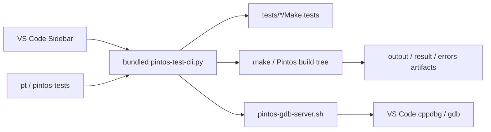

# Pintos Test Explorer

언어: [English](README.md) | 한국어

Pintos Test Explorer는 VS Code 사이드바와 터미널 CLI를 하나의 흐름으로 묶는 확장입니다. 이 저장소에는 확장 소스, bundled helper, 그리고 배포용 VSIX 패키징 스크립트가 함께 들어 있습니다.

## 한눈에 보기

```text
1. Pintos 테스트를 Make.tests에서 직접 읽어옵니다.
2. 사이드바, pt, pintos-tests가 같은 helper 로직을 공유합니다.
3. pintos_22.04_lab_docker 같은 wrapper 구조도 고정 폴더명 없이 처리합니다.
4. 오래된 group JSON을 기본적으로 무시해서 Alarm Clock 같은 기본 폴더명이 깨지지 않게 합니다.
5. 빌드 실패가 나도 compiler 출력은 errors artifact에 그대로 남깁니다.
```



## 사용자 사용 흐름

현재 릴리스는 아래 워크스페이스 구조를 지원합니다.

- Pintos 루트 자체
- 내부에 `pintos/`가 들어 있는 wrapper 저장소
- `src/` 루트
- `pintos_22.04_lab_docker` 같은 nested lab 구조

빠른 VS Code 사용 흐름:

1. 확장을 설치하거나 VSIX를 로드합니다.
2. 창을 한 번 다시 로드합니다.
3. Activity Bar의 `Pintos` 뷰를 엽니다.
4. 테스트 행에서 바로 run 또는 debug 합니다.
5. 폴더나 테스트를 체크한 뒤 `Run Checked Tests`를 사용합니다.
6. 필요하면 트리에서 `output`, `result`, `errors` artifact를 바로 엽니다.

빠른 터미널 사용 흐름:

```bash
pt projects
pt list threads
pt run threads alarm-zero
pt debug vm 4 --server-only
pt reset threads alarm-*
pt artifacts threads alarm-zero
```

확장이 이미 활성화된 상태라면 새 통합 터미널에서 `pt`와 `pintos-tests`를 바로 쓸 수 있어야 합니다. 소스 checkout 기준으로는 아래처럼도 실행할 수 있습니다.

```bash
./pt --help
./pintos-tests --help
```

## 저장소 작업 흐름

이 저장소에서 중요하게 보는 경로:

- `extension/`: 확장 소스, 패키징용 README, bundled helper, manifest
- `scripts/build-pintos-test-explorer-vsix.py`: 배포용 offline VSIX 빌더
- `dist/`: 생성된 VSIX 아티팩트

이 checkout에서 배포용 VSIX를 만들려면:

```bash
python3 scripts/build-pintos-test-explorer-vsix.py
```

문서는 용도별로 나눠서 관리합니다.

- GitHub README: `README.md`, `README.ko.md`
- Marketplace README 원본: `extension/README.md`, `extension/README.ko.md`
- 패키징 규칙: VSIX 빌더가 `extension/README.md` 안의 상대 링크를 GitHub 절대 링크로 바꿔서 Marketplace 404를 막습니다

## 문제 해결

### wrapper 저장소에서 테스트 인식이 이상할 때

자동 인식이 충분하지 않으면 실제 Pintos 루트를 직접 지정하세요.

```bash
PINTOS_ROOT=/path/to/pintos pt list threads
```

### stale custom entry 때문에 빌드가 계속 깨질 때

`priority-change`처럼 다른 테스트를 돌렸는데도 `tests/threads/custom/...` 컴파일에서 계속 실패한다면, 워크스페이스에 예전 custom 등록이 남아 있을 가능성이 큽니다.

```bash
pt custom delete threads custom/new-test
```

에러가 `tests/threads/custom/new-test.d` 같은 dependency file 누락으로 나온다면, 최신 VSIX로 다시 로드한 뒤 한 번 더 실행해서 확장이 대응되는 build 하위 폴더를 다시 만들게 해주세요.

### `Alarm Clock`이 계속 `New Group`으로 보일 때

`.vscode/pintos-test-explorer/groups/threads/new-group.json` 같은 오래된 파일은 현재 릴리스에서 기본적으로 무시됩니다. 그래도 예전 라벨이 보이면 최신 VSIX로 다시 로드하세요. 그 stale JSON 파일을 직접 지워도 안전합니다.

### debug restart가 아직도 이상할 때

현재 릴리스는 VS Code `Restart`도 최초 debug 시작과 같은 준비 경로로 처리합니다. 예전 동작이 계속 보이면 창을 다시 로드하고, 실제로 최신 VSIX가 설치되어 있는지 확인하세요.
