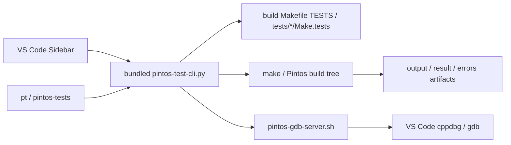

# Pintos Test Explorer

Languages: English | [한국어](README.ko.md)

Pintos Test Explorer is a VS Code sidebar extension plus a bundled terminal CLI for running Pintos tests with one shared workflow. This repository is the source tree for the extension, the bundled helpers, and the release packaging script.

## Snapshot

```text
1. Match the build directory's project-owned test list when a build Makefile exists.
2. Use the same helper logic from the sidebar, pt, and pintos-tests.
3. Handle wrapper layouts such as pintos_22.04_lab_docker without hard-coding one folder name.
4. Ignore stale old group JSON so built-in folders like Alarm Clock keep their intended names.
5. Keep full compiler output in the errors artifact even when a run fails during build.
6. Keep repeated checkbox selection fast by reusing discovered test data until a real refresh is needed.
7. Ask for Microsoft C/C++ only when a user starts Debug, not during extension install.
```



## User Workflow

The current release supports these workspace layouts:

- the Pintos root itself
- a wrapper repository that contains `pintos/`
- a `src/` root
- nested lab layouts such as `pintos_22.04_lab_docker`

Quick VS Code flow:

1. Install the extension or load the VSIX.
2. Reload the window once.
3. Open the `Pintos` activity-bar view.
4. Run or debug a test from its row.
5. Check folders or tests and use `Run Checked Tests`.
6. Open `output`, `result`, or `errors` artifacts directly from the tree when you need details.

Quick terminal flow:

```bash
pt projects
pt list threads
pt run threads alarm-zero
pt debug vm 4 --server-only
pt reset threads alarm-*
pt artifacts threads alarm-zero
```

If the extension is already active, a new integrated terminal should recognize both `pt` and `pintos-tests`. From a source checkout, you can also run:

```bash
./pt --help
./pintos-tests --help
```

## Repository Workflow

Important paths in this repository:

- `extension/`: extension source, packaged README files, bundled helpers, manifest
- `scripts/build-pintos-test-explorer-vsix.py`: offline VSIX builder used for release packaging
- `dist/`: generated VSIX artifacts

Build a release VSIX from this checkout with:

```bash
python3 scripts/build-pintos-test-explorer-vsix.py
```

Documentation is intentionally split by audience:

- GitHub README: `README.md` and `README.ko.md`
- Marketplace README source: `extension/README.md` and `extension/README.ko.md`
- Packaging rule: the VSIX builder rewrites relative links inside `extension/README.md` so Marketplace links point back to GitHub correctly

## Troubleshooting

### Test discovery looks wrong in a wrapper repo

Point the CLI at the real Pintos root if auto-detection is not enough:

```bash
PINTOS_ROOT=/path/to/pintos pt list threads
```

### A stale custom entry keeps breaking builds

If a run on something unrelated such as `priority-change` still fails while compiling `tests/threads/custom/...`, the workspace likely has an old custom registration left behind:

```bash
pt custom delete threads custom/new-test
```

If the error mentions a missing dependency file such as `tests/threads/custom/new-test.d`, reload the latest VSIX and rerun once so the extension can recreate the matching build subdirectory before the next build.

### `Alarm Clock` still shows up as `New Group`

Old files such as `.vscode/pintos-test-explorer/groups/threads/new-group.json` are ignored by default in the current release. If you still see the old label, reload onto the latest VSIX. Deleting that stale JSON file is also safe.

### Debug restart still feels stuck

The current release routes VS Code `Restart` through the same debug-preparation path as the first launch. If old behavior persists, reload the window and confirm you are actually on the newest VSIX.
