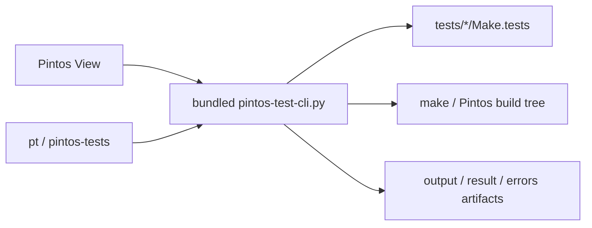

# Pintos Test Explorer

언어: [English](README.md) | 한국어

Pintos Test Explorer는 Pintos 테스트 전용 VS Code 사이드바를 추가하고, 같은 기능을 `pt`와 `pintos-tests` CLI로도 함께 제공합니다. 사이드바와 CLI가 같은 bundled helper를 공유하므로 테스트 인식, 실행/디버그, artifact 처리, 루트 인식 규칙이 서로 어긋나지 않습니다.

## 핵심 요약

```text
1. Pintos 테스트를 Make.tests에서 직접 읽어옵니다.
2. VS Code와 터미널에서 같은 규칙으로 run / debug / reset / artifact 확인을 합니다.
3. 직접 Pintos 루트뿐 아니라 pintos_22.04_lab_docker 같은 wrapper 구조도 처리합니다.
4. 오래된 group JSON을 기본적으로 무시해서 Alarm Clock 같은 기본 폴더명이 깨지지 않게 합니다.
```



## 지원하는 구조

확장은 실제 Pintos 루트를 찾으며 아래 구조를 지원합니다.

- Pintos 루트 자체
- 내부에 `pintos/`가 들어 있는 wrapper 저장소
- `src/` 루트
- `pintos_22.04_lab_docker` 같은 nested lab 구조

필요하면 CLI에서 실제 루트를 직접 지정할 수도 있습니다.

```bash
PINTOS_ROOT=/path/to/pintos pt list threads
```

## 설치 후 사용

1. 창을 한 번 다시 로드합니다.
2. Activity Bar의 `Pintos` 뷰를 엽니다.
3. 프로젝트를 펼쳐 테스트 행에서 바로 run 또는 debug 합니다.
4. 폴더나 테스트를 체크한 뒤 `Run Checked Tests`를 사용합니다.
5. 필요하면 트리에서 `output`, `result`, `errors` artifact를 바로 엽니다.

활성화 후 새 통합 터미널에서는 아래 명령이 보여야 합니다.

```bash
pt --help
pintos-tests --help
```

VS Code 밖에서도 계속 쓰고 싶다면 `Pintos: Install CLI Wrappers to Shell` 명령을 실행하세요.

## 터미널 사용 예시

```bash
pt projects
pt list threads
pt run threads alarm-zero
pt debug vm 4 --server-only
pt reset threads alarm-*
pt reset-all
pt artifacts threads alarm-zero
```

## Selector 규칙

- `11-20`은 양끝 포함 숫자 범위입니다.
- `alarm-zero`는 정확한 짧은 이름으로 선택합니다.
- `tests/threads/alarm-zero` 형태도 사용할 수 있습니다.
- `alarm-*`는 와일드카드 패턴입니다.
- `all`은 `run`과 프로젝트 단위 `reset`에서 지원합니다.
- `debug`와 `artifacts`는 정확히 하나의 테스트여야 합니다.
- `--recent-first`는 로컬 사용 기록을 기준으로 재정렬합니다.

## 문제 해결

### stale custom entry 때문에 빌드가 계속 깨질 때

`priority-change`처럼 다른 테스트를 돌렸는데도 `tests/threads/custom/...` 컴파일에서 계속 실패한다면, 워크스페이스에 예전 custom 등록이 남아 있을 가능성이 큽니다.

```bash
pt custom delete threads custom/new-test
```

에러가 `tests/threads/custom/new-test.d` 같은 dependency file 누락으로 나온다면, 최신 VSIX로 다시 로드한 뒤 한 번 더 실행해서 확장이 대응되는 build 하위 폴더를 다시 만들게 해주세요.

### `Alarm Clock`이 계속 `New Group`으로 보일 때

`.vscode/pintos-test-explorer/groups/threads/new-group.json` 같은 오래된 파일은 현재 릴리스에서 기본적으로 무시됩니다. 그래도 예전 라벨이 보이면 최신 VSIX로 다시 로드하세요. 그 stale JSON 파일을 직접 지워도 안전합니다.

### debug restart가 아직도 이상할 때

현재 릴리스는 VS Code `Restart`도 최초 debug 시작과 같은 준비 경로로 처리합니다. 예전 동작이 계속 보이면 창을 다시 로드하고, 실제로 최신 VSIX가 설치되어 있는지 확인하세요.
