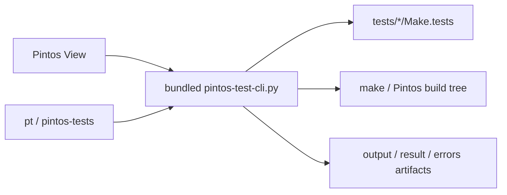

# Pintos Test Explorer

Languages: English | [한국어](README.ko.md)

Pintos Test Explorer adds a dedicated VS Code sidebar for Pintos tests and ships a matching CLI through `pt` and `pintos-tests`. The sidebar and CLI share the same bundled helper, so discovery, run/debug behavior, artifact handling, and root detection stay aligned.

## Quick Summary

```text
1. Read Pintos tests directly from Make.tests.
2. Run, debug, reset, and inspect artifacts from VS Code or the terminal.
3. Work from direct Pintos roots or wrapper layouts such as pintos_22.04_lab_docker.
4. Ignore stale old group JSON so built-in folders like Alarm Clock keep their intended names.
```



## Supported Layouts

The extension looks for a real Pintos root and supports:

- the Pintos root itself
- a wrapper repository that contains `pintos/`
- a `src/` root
- nested lab layouts such as `pintos_22.04_lab_docker`

If needed, you can still point the CLI at the real root:

```bash
PINTOS_ROOT=/path/to/pintos pt list threads
```

## After Installation

1. Reload the window once.
2. Open the `Pintos` activity-bar view.
3. Expand a project and run or debug a test from its row.
4. Check folders or tests and use `Run Checked Tests`.
5. Open `output`, `result`, or `errors` artifacts directly from the tree.

After activation, a new integrated terminal should recognize:

```bash
pt --help
pintos-tests --help
```

If you want shell-wide wrappers outside VS Code, run `Pintos: Install CLI Wrappers to Shell`.

## Terminal Workflow

```bash
pt projects
pt list threads
pt run threads alarm-zero
pt debug vm 4 --server-only
pt reset threads alarm-*
pt reset-all
pt artifacts threads alarm-zero
```

## Selector Rules

- `11-20` means an inclusive numeric range.
- `alarm-zero` selects by exact short name.
- `tests/threads/alarm-zero` also works.
- `alarm-*` works as a wildcard pattern.
- `all` is supported by `run` and project-scoped `reset`.
- `debug` and `artifacts` must resolve to exactly one test.
- `--recent-first` reorders the list from local usage history.

## Troubleshooting

### A stale custom entry keeps breaking builds

If a run on something unrelated such as `priority-change` still fails while compiling `tests/threads/custom/...`, the workspace likely has an old custom registration left behind:

```bash
pt custom delete threads custom/new-test
```

If the error mentions a missing dependency file such as `tests/threads/custom/new-test.d`, reload the latest VSIX and rerun once so the extension can recreate the matching build subdirectory before the next build.

### `Alarm Clock` still shows up as `New Group`

Old files such as `.vscode/pintos-test-explorer/groups/threads/new-group.json` are ignored by default in the current release. If you still see the old label, reload onto the latest VSIX. Deleting that stale JSON file is also safe.

### Debug restart still feels stuck

The current release routes VS Code `Restart` through the same debug-preparation path as the first launch. If old behavior persists, reload the window and confirm you are actually on the newest VSIX.
